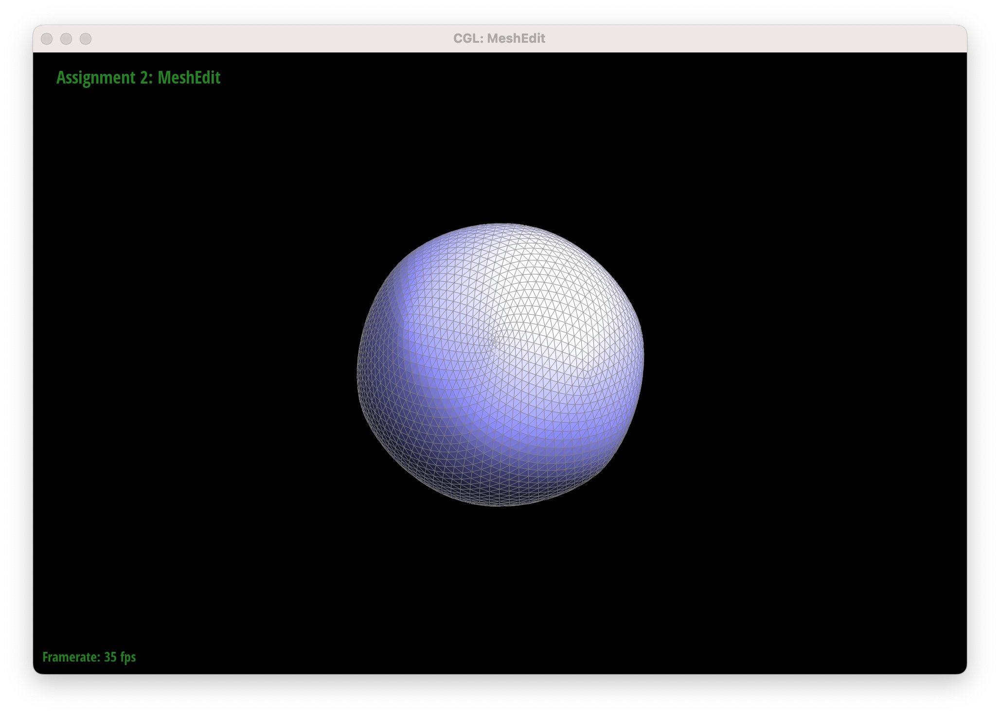

# Section I: Bezier Curves and Surfaces

## Part 1: Bezier Curves with 1D de Casteljau Subdivision
This part requires to implement the de Casteljau algorithm for computing a point on a Bezier curve. Given a set of 2D control points and a scalar parameter `t` (with `0 ≤ t ≤ 1`), we recursively interpolate between adjacent control points until converging to a single point on the curve. The GUI allows stepping through each iteration to display the intermediate control points, and the final converged point will be clearly highlighted.

In this part, we implemented the function `BezierCurve::evaluateStep`, which:
- Reserves space for a new vector of points.
- Iterates through the input control points, performing linear interpolation for each pair using the formula:
  $\mathbf{p}'_i = (1-t)\,\mathbf{p}_i + t\,\mathbf{p}_{i+1}$
- Returns the resulting vector of interpolated points.

By repeatedly calling `evaluateStep`, the algorithm gradually reduces the number of points until only one point remains, which is the evaluated point on the Bezier curve.

The following screenshots show the progression of the de Casteljau algorithm on our own Bezier curve. Screenshot 1-6 shows the original Bezier Curve and the curve after 1-5 iterations. The last screenshot shows the De Casteljau algorithm operating on a list of slightly moved points and a modified t value.

Initial Control Points

First Iteration

Second Iteration

Third Iteration

Fourth Iteration

Final Convergence

Modified Curve

## Part 2: Bezier surfaces with separable 1D de Casteljau
In this part, we evaluate Bezier surfaces by extending the de Casteljau algorithm. Given two parameters, `u` and `v`, both of which fall within the range [0, 1]. Our objective is to calculate a point on the surface. To do this, each row of control points is first evaluated as a 1D Bezier curve using the parameter `u`. The final point on the surface is then obtained by treating the resulting set of points as control points of another 1D Bezier curve that is evaluated with the value `v`.

We implemented the solution in the `BezierPatch` class by defining three key functions:

- **`evaluateStep(points, t)`**: This function takes a vector of 3D points and a scalar `t` as input and returns a new vector of points, each computed by linearly interpolating between consecutive points using the formula  
  $\mathbf{p}'_i = (1-t) \cdot \mathbf{p}_i + t \cdot \mathbf{p}_{i+1}.$
  
- **`evaluate1D(points, t)`**: This function recursively calls `evaluateStep` on the vector of points until only one point remains. That single point is the evaluated point on the corresponding 1D Bezier curve.

- **`evaluate(u, v)`**: To evaluate the surface, We first loop through each row of the 2D grid of control points and call `evaluate1D` with the parameter `u` to obtain an intermediate point for each row. Then, we form a new vector with these intermediate points and call `evaluate1D` with the parameter `v` to compute the final evaluated point on the surface.

The following screenshot is the image of teapot.bez using Bezier Surfaces.

Evaluated Bezier Surface

# Section II: Triangle Meshes and Half-Edge Data Structure

## Part 3: Area-Weighted Vertex Normals
In Part 3, we are required to compute a smooth, unit normal at each vertex of a triangle mesh using the half-edge data structure. Instead of using flat shading (which uses a single face normal per triangle), we compute an area-weighted average of the normals of all faces incident to a vertex. This method is essential for achieving smooth Phong shading.

Our implementation of `Vertex::normal()` proceeds as follows:
- Initialize an accumulator vector (`accumNormal`) to (0, 0, 0).
- Retrieve the vertex's half-edge (using `halfedge()`), which serves as the starting point for traversal.
- Loop over all incident faces by following the `twin()->next()` chain until we return to the starting half-edge.
- For each face (excluding those on a boundary), calculate its area using:
  $\text{Area} = 0.5 \times \| (p_1 - p_0) \times (p_2 - p_0) \|$
  where $( p_0 )$ is the position of the vertex, $( p_1 )$ and $( p_2 )$ are positions of the other two vertices of the face.
- Multiply the face's normal by the computed area and add it to the accumulator.
- Finally, normalize the accumulated vector to produce the unit vertex normal.

The following screenshots are images of teapot.dae with and without phong shading and without the wire framing.

Flat Shading

Phone Shading

Without Wire

## Part4: Edge Flip
In Part 4, we use the half-edge data structure to apply the **edge flip** operation to a triangular mesh. When two adjacent triangles share an edge, the procedure "flips" that edge, substituting the other diagonal of the quadrilateral the two triangles make for the shared edge. When two triangles (a, b, c) and (c, b, d) share the edge (b, c), for instance, the flip swaps out this edge, creating the new triangles (a, d, c) and (a, b, d respectively).

Our implementation of `HalfedgeMesh::flipEdge(...)` follows these steps: First, the function checks if the given edge is a boundary edge. If it is, no flip is performed. Then, the algorithm collects all the relevant half-edges for the two adjacent triangles. After that, the core of the flip operation involves reassigning the pointers. Finally, since no new elements are created or removed, all pointer updates are local and done in constant time, ensuring the integrity of the mesh data structure.

The following screenshots are Teapot Mesh before and after Edge Flip. 

Without Flip

With Some Flips

## Debug Journey
During the implementation, We encountered an issue where flipping an edge twice sometimes created a hole in the mesh. To resolve this, we first sketched the local configuration of the two triangles on paper, labeling all half-edges, vertices, and faces. Then we employed provided debugging macros (like `CHECK_VERTEX` and `CHECK_CLOSED`) to ensure that, after the flip, all pointers correctly pointed to the expected elements. So after the corrections, the edge flip operation consistently maintained mesh integrity even after multiple flips, as verified by both visual inspection and debug checks.

## Part 5: Edge Split
In Part 5, we implement an edge split operation using the half-edge data structures. Our implementation of `HalfedgeMesh::splitEdge(...)` proceeds as follows:
- The function first checks if the target edge is a boundary edge. If it is, the operation is skipped.
- The method retrieves the necessary local elements:  
  - The half-edge corresponding to the edge and its neighboring half-edges from both adjacent triangles.
  - The vertices at the endpoints of the edge, as well as the vertices opposite to the edge in each triangle.
  - The edges and faces associated with these half-edges. 
- New half-edges, edges, and faces are created to accommodate the split. A new vertex is generated and its position is computed as the midpoint of the original edge.
- The function carefully reassigns the pointers for the affected half-edges, vertices, edges, and faces so that the original two triangles are subdivided into four well-connected triangles. This ensures that the connectivity and integrity of the mesh remain intact after the split.

The following Screenshots are a mesh before and after some edge splits, and a mesh before and after a combination of both edge splits and edge flips.

Without Splits

With some Splits

Without Flips and Splits

With some Flips and Splits

### Debugging Journey
During the development of the edge split operation, We encountered challenges related to pointer reassignments due to the increased number of new elements created. To debug: We drew detailed diagrams of the local neighborhood of the target edge, labeling each half-edge, vertex, and face. This helped me verify the correct reassignment of pointers. We repeatedly performed edge splits and then followed up with edge flips to test the robustness of the operation, ensuring that no holes or misconnected elements appeared in the mesh.

# Part 6: Loop Subdivision for Mesh Upsampling
In this part, we upscale a coarse polygon mesh using Loop subdivision. The goal is to convert a low-resolution mesh into a higher-resolution one.

My implementation follows these steps:

- For every edge, We first set its `isNew` flag to false. Then, we compute a new position for the midpoint:
  - Use the weighted average formula \(\frac{3}{8}(v_0+v_1) + \frac{1}{8}(v_2+v_3)\).
  - Use the simple midpoint \(0.5 \times (v_0 + v_1)\).
- For each vertex, if it is a boundary vertex, we gather its two boundary neighbors and update its new position using $0.75 \times \text{originalPos} + 0.125 \times (\text{neighbor1} + \text{neighbor2})$. Otherwise, for interior vertices, We sum the positions of all neighboring vertices (traversed via the half-edge loop), calculate a weight based on the vertex degree, and compute the new position accordingly.
- We then iterate over all original edges (those whose endpoints are not marked as new) and split each edge, assigning the precomputed midpoint as the new vertex position.
- After splitting, We process the edges again: if an edge is new and connects one new vertex with one old vertex, we flip it. This ensures that only the proper edges (depicted as blue in the assignment diagram) are flipped while preserving the original boundary of the subdivided triangles.
- Finally, all vertices are updated with their new positions, and the `isNew` flags are reset.

## 3. Debugging and Observations

During the development of the Loop subdivision:
  - We drew diagrams of local mesh configurations to carefully track the pointer reassignments during edge splits and flips.
  - Iterative testing was crucial—after each subdivision, we visually inspected the mesh to confirm that no holes or misconnected elements appeared.

- Observations on Mesh Behavior: 
  - With each iteration, the mesh becomes significantly smoother as the coarse triangles are subdivided into finer ones.  
  - For meshes with boundaries, applying the adjusted weighting for boundary vertices helped maintain a more natural look along the edges.
  - Initially sharp features tend to round off after subdivision.  
  - When testing on a cube (using `dae/cube.dae`), we noticed that after several iterations the cube sometimes becomes slightly asymmetric. By pre-processing the cube (performing targeted edge flips and splits) to increase the number of triangles per face, the subdivision converged to a more symmetric shape.

Below are the screenshots documenting the progress of loop subdivision on three different models. Each set shows the mesh at 0 through 4 subdivisions, demonstrating how the mesh becomes smoother and more detailed with each iteration.

### Torus (edgeCollapse.dae)

Torus model at 0 subdivisions (original mesh).

Torus model after 1 iteration of loop subdivision.

Torus model after 2 iterations of loop subdivision.

Torus model after 3 iterations of loop subdivision.

Torus model after 4 iterations of loop subdivision.

### Cube (edgeFlip.dae)

Cube model at 0 subdivisions (original mesh).

Cube model after 1 iteration of loop subdivision.

Cube model after 2 iterations of loop subdivision.

Cube model after 3 iterations of loop subdivision.

Cube model after 4 iterations of loop subdivision.

### Icosahedron (edgeSplit.dae)

Icosahedron model at 0 subdivisions (original mesh).

Icosahedron model after 1 iteration of loop subdivision.

Icosahedron model after 2 iterations of loop subdivision.

Icosahedron model after 3 iterations of loop subdivision.

Icosahedron model after 4 iterations of loop subdivision.
