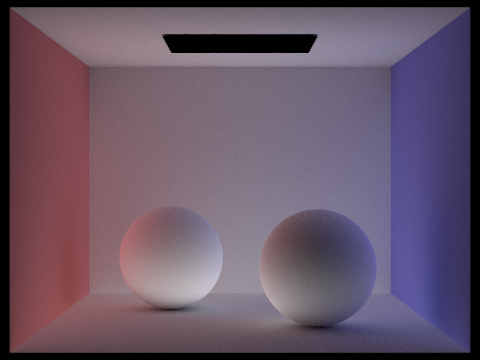

---

title: CS184 HW3 Writeup
subtitle:
date: 2025-03-14T00:05:27-08:00
slug: 189hw3
draft: false
description:
keywords:
license:
comment: false
weight: 0
tags:
  - CS184
categories:
  - CS184
hiddenFromHomePage: false
hiddenFromSearch: false
hiddenFromRelated: false
hiddenFromFeed: false
summary:
resources:
  - name: featured-image
    src: featured-image.jpg
  - name: featured-image-preview
    src: featured-image-preview.jpg
toc: true
math: true
lightgallery: false
password:
message:
---


# CS184 Homework 3 Write-Up

> https://alexdwastaken.github.io/Blog/posts/189hw3/
> **Group members: Xize Duan, Phoenix Ye**
> 
> We used Claude 3.7 Sonnet for language polishing. The code and the body of the write up is completely written by us.

## Overview

In Part 1, We implemented ray generation and scene intersection, creating rays through pixels with random sampling, transforming between coordinate spaces, and developing intersection algorithms for triangles and spheres.

In Part 2, We built a Bounding Volume Hierarchy (BVH) that accelerated ray-scene intersection by organizing geometry in a tree structure, reducing complexity from O(n) to O(log n) and dramatically improving render times.

In Part 3, We implemented direct illumination with diffuse BSDFs and compared uniform hemisphere sampling with importance sampling, demonstrating that the latter produces cleaner images with better handling of light sources.

In Part 4, We extended our renderer to simulate global illumination with multiple light bounces, implementing recursive ray tracing and Russian Roulette path termination to capture realistic light transport throughout scenes.

In Part 5, We implemented adaptive sampling that varies sample count based on pixel variance, using statistical confidence intervals to allocate computational resources efficiently while maintaining image quality.

Overall, we learned how to trace a ray, how to build a BVH and how to calculate illumination recursively. It's a rewarding experience both in graphics and in C++.

## Part1: Ray Generation and Scene Intersection

In this part, we generated rays according to the positions on the screen space, and did perspecive projections to transform these rays into camera space. We first generated pixel sample points on $(x, y) \in [0, w] \times [0, h]$ ,  and generated two randoms samples from $X, Y \sim\text{Unif}(0, 1)$, and eventually got random pixel samples $(x+X, y+Y)$. After that, we generate rays from the origin and test intersections along the rays. 

The first key is to distinguish the different space present in this case

- **Pixel space, image space, sensor space** and **camera space** are different. 
- By normalizing 2D **pixel space**, we get the **image spac**e. 
- The **image space** can be transformed into the **sensor space** by aliging the borders (since both are rectangular shapes). Specifically, (0, 0) goes to $(-\tan (0.5 \cdot hfov), -\tan(0.5.vhov))$ and $(1, 1)$ goes to $(\tan (0.5 \cdot hfov), \tan(0.5.vhov))$.
- The **sensor space** sits on $(0, 0, -1)$ of the **camera space** and is perpendicular to $z$ direction. Appending (-1) to a new dimension of the sensor space gives the position of the point in camera space.
- A ray is casted from the origin to the **camera space** sample point.

The second key is to cast rays, and properly set the ray up.

- Ray equation is $\vec o + t \vec d$, and to ensure the consistency of each ray, $\vec d$ has to be normalized! (a lot of bugs encountered!)
- There are two fields `ray.min_t` `ray.max_t`. These are used to determine where the ray stars and when it ends. This caused a lot of bugs.
- `c2w` matrix converts camera space to world space. We do not have to invert this! (a lot of bugs encountered!)

To test the triangle intersection, we adopt the algorithm proposed in class. A short idea is to obtain the intersection of the ray and the plane, and calculate the berycentric coordinates with respect to the triangle. The coordinates can be calculated by doing cross products (since the cross product of two edges equals to the area of the triangle created by the two edges, and we can obtain berycentric coordinates by area). If the berycentric coordinates $\alpha, \beta$ and $\gamma$ are all positive, then the point lies in the triangle. An detail of implementation is that we can use dot product of components to avoid re-calculating same things.

To test the sphere intersection, we solved a quadratic function for `t1` and `t2`. The important thing is to **set `ray.min_t` `ray.max_t` after every valid intersection!; If not, we cannot detect the occlusion relation of an object correctly**. Becuase we didn't set the `t` values correctly, the balls won't render because triangle is tested last.

Here are some of the example renders.

| Example 1: Empty                                             | Example 2: Spheres                                           |
| ------------------------------------------------------------ | ------------------------------------------------------------ |
|  |  |

 

## Part 2: Bounding Volume Hierarchy

BVH partitions the objects into different bounding boxes organized in a tree structure to accelerate ray-scene intersection, and it's very useful in ray tracing because it shrinks the complexity from $O(n)$ to $O(\log n)$ with a good policy.

### Construction

In our implementation, bvh is seperated along the longest axis with median centroid. The first step is to determine whether the node is a leaf node by comparing the current `element_count` with `max_leaf_size`. If it already is, fill in `start` and `end` field and return directly.

If the node is not a leaf node, then we find its median and partition accordingly (with a functional programming style!)

```c++
std::nth_element(start, mid, end, 
    [splitDim](const Primitive* a, const Primitive* b) {
      return a->get_bbox().centroid()[splitDim] < b->get_bbox().centroid()[splitDim];
    });
```

This function partitions without sorting completely. After that, we create new BVH nodes and construct with the left half and right half, and link the new nodes to `l` and `r`.

A detail here is about the inclusiveness of 'start' and 'end'. In our implementation, we have to use

```c++
auto leftStart = start;
auto leftEnd = mid;
auto rightStart = mid;
auto rightEnd = end;
```

where `mid` presents two times instead of one `mid` and one `mid++`. We guess this is related to the implementation of iterators.

### Intersection

Intersecting the bounding box is simple. We just record the last 'in' time and first 'out' time. If the 'in' time is before 'out' time, then a intersection is detected, and we can return accordingly.

One of the function only asks us to test whether there is a intersection; to solve that, write a simple recursion: if it is a leaf node, simply test every object inside; if not, return `has_intersection(ray, node->l) || has_intersection(ray, node->r)`. Another function asks us to record the hit position as well, in this case, just record the position in the `Intersection` object is fine.

We did not encounter any problem when realizing the intersection functions.

 ### Results

Here are some example images of large scenes with normal shading.

| Dragon                                                       | Lucy                                                         | Maxplanck                                                    |
| ------------------------------------------------------------ | ------------------------------------------------------------ | ------------------------------------------------------------ |
|  |  |  |

Here we analyze the rendering time with and without bvh. Here are the data:

| Scene | Primitives | Without BVH (Render) | With BVH (Render + Build BVH) |
| ----- | ---------- | -------------------- | ----------------------------- |
| Gems  | 252        | 12.4182s             | 0.2220s+0.0001s               |
| Empty | 12         | 0.5307s              | 0.1796s + 0.0000s             |
| Cow   | 5856       | 80.9856s             | 0.0888s+0.0036s               |
| Bunny | 28588      | Stuck                | 0.1170s+0.3080s               |

The results demonstrate the significant impact of BVH acceleration on rendering performance. Without BVH, rendering times increase dramatically with scene complexity, with the Bunny scene failing to complete due to excessive computations. In contrast, BVH-based rendering consistently achieves great speedups, reducing rendering times by orders of magnitude. Even when factoring in BVH construction time, the total cost remains negligible. For example, in the Cow scene, rendering time drops from 80.99s to just 0.0888s, while BVH construction takes only 0.0036s. This highlights BVH's effectiveness in reducing ray intersection tests and optimizing traversal, making it indispensable for efficient ray tracing in complex scenes.

## Part 3: Direct Illumination

In this part, we will start simulating light transport in the scene, and render images with realistic shading. We walked through implementing BSDF, zero bounce illumination and one bounce illumination. We also compared uniform hemisphere sampling with direct importance sampling.

### BSDF

To implement diffuse BSDF, we only need to plug the reflectance into the formula. We attatch the code, which should be self-explanatory.

```c++
Vector3D DiffuseBSDF::f(const Vector3D wo, const Vector3D wi) {
  return reflectance * (1.0 / PI);
}

Vector3D DiffuseBSDF::sample_f(const Vector3D wo, Vector3D *wi, double *pdf) {
  *pdf = 1.0 / PI;
  *wi = sampler.get_sample(pdf);
  return f(wo, *wi);
}
```

### Zero Bounce

This part is equally simple once we figured out how to get light: get BSDF from the `Intersection` object, and get emission by calling `get_emission()` from the BSDF.

```c++
Vector3D PathTracer::zero_bounce_radiance(const Ray &r,
                                          const Intersection &isect) {
  return isect.bsdf->get_emission();
}
```

### One Bounce with Uniform Hemisphere Sampling

We looped through `num_samples` to create monte carlo estimate according to the illumination psudocode from the lecture.

We want to particularly highlight how the coordinate transformation works. When getting sample from `hemisphereSampler->get_sample()`, what we have is a local coordinate, and what we have to do is to conver it to global coordinate by `o2w`. After that, we cast ray and obtain emission and probability. Note that $\cos \theta$ can be directly computed by the $z$ coordinate of the local coordinate system. After that, normalize by $\frac{2\pi}{\text{samples}}$ .

A detail is to set `sample_ray.min_t = EPS_D`. This is to prevent floating point error, where the light intersects the surface itself. We attach the key part of the code here:

```c++
if (bvh->intersect(sample_ray, &light_isect)) {
      Vector3D L_i = light_isect.bsdf->get_emission();
      Vector3D f = isect.bsdf->f(w_out, wi);
      double cos_theta = wi.z; // wi is already in local coordinates where N = (0,0,1)
      L_out += f * L_i * cos_theta;
    }
```

### One Bounce with Importance Sampling

Instead of uniformly sampling all possible directions, importance sampling strategically samples based on the probability distribution of the light sources or the BSDF, reducing noise and improving convergence. We explain how this works by comparing with uniform hemisphere sampling.

The key difference between the two methods lies in how samples are chosen. In direct hemisphere sampling, the algorithm selects random directions uniformly over the hemisphere above the surface. This approach does not consider whether the sampled directions actually lead to light sources, leading to many unnecessary samples. In contrast, importance sampling directly selects sample directions based on the distribution of light sources (`L_i = light->sample_L(hit_p, &wi, &distToLight, &pdf)`). By sampling only directions that contribute significantly to illumination, importance sampling reduces variance and improves efficiency. Also, importance sampling uses the idea of "shadow rays", as the rays that do not reach the light source is equivalent to the ray is in the shadow.

Since direct hemisphere sampling distributes samples uniformly, it normalizes the accumulated radiance by multiplying by $\frac{2\pi}{\text{samples}}$, assuming an even distribution. However, importance sampling assigns each sample a probability density function (PDF) based on the likelihood of choosing that direction. This allows the algorithm to correctly weigh contributions, ensuring that the results remain unbiased while achieving faster convergence with fewer samples. **Note that we do not re-normalize by 2$\pi$ again as the PDF already tells us the probability! (A lot of bugs encountered by adding unecessary normalization!)**

Also, note that delta light only needs to be handled once. Delta light will almost never be sampled in uniform hemisphere sampling but is supported with importanc sampling.

Here are the key part of the code:

```c++

      if (!bvh->intersect(shadow_ray, &shadow_isect)) {
        Vector3D f = isect.bsdf->f(w_out, wi_local);
        double cos_theta = wi_local.z;
        
        // Add contribution if cos_theta is positive
        if (cos_theta > 0) {
          L_out += f * L_i * cos_theta / pdf / samples;
        }
```

### Results

Here are some samples rendered with both implementations.

|            | Bunny                                                        | Balls                                                        | Bench (Point light, not supported by uniform sampling)       |
| ---------- | ------------------------------------------------------------ | ------------------------------------------------------------ | ------------------------------------------------------------ |
| Uniform    |  |  |  |
| Importance |  |  |  |

Here is one particular scene with at least one area light and compare the noise levels in soft shadows when rendering with 1, 4, 16, and 64 light rays. We can see that as the light rays goes up, the noise level goes down even we are still using one sample per pixel.

| Light Rays | 1                                                            | 4                                                            | 16                                                           | 64                                                           |
| ---------- | ------------------------------------------------------------ | ------------------------------------------------------------ | ------------------------------------------------------------ | ------------------------------------------------------------ |
| Results    |  |  |  |  |

Here we provide a short analysis between uniform hemisphere sampling and lighting sampling. In the uniform hemisphere sampling results (top row), the images exhibit high levels of noise due to the random selection of sample directions, many of which do not contribute effectively to lighting. Additionally, the bench scene is entirely black because uniform sampling fails to capture point light sources, which require targeted sampling. In contrast, the importance sampling results (bottom row) are significantly cleaner, with less noise and better-defined shadows, as more samples are concentrated in relevant light directions. The bench scene is also correctly illuminated, demonstrating the effectiveness of light sampling in handling point lights. This comparison clearly illustrates that importance sampling leads to higher-quality renderings.

## Part 4: Global Illumination

In this part, we implemented the feature that calculates the bounces of lights.

### Sampling with Diffuse BSDF

To implement the sample function of diffuse BSDF, we only need to plug the reflectance into the formula. We attatch the code, which should be self-explanatory.

```c++
Vector3D DiffuseBSDF::sample_f(const Vector3D wo, Vector3D *wi, double *pdf) {
  *wi = sampler.get_sample();
  *pdf = (wi->z) / (PI); //cosine weighted
  return f(wo, *wi);
}
```

### Global Illumination with N bounces

The function, `at_least_one_bounce_radiance`, computes indirect lighting in a path tracer by recursively tracing bounces of light. We first constructs an orthonormal coordinate system (`o2w`) based on the surface normal and converts the world-space outgoing direction to local space.

The intersection point is calculated, and if the ray has reached the maximum depth, we can returns direct lighting (`one_bounce_radiance`). Otherwise, it samples a new incoming direction (`wi`) using the BSDF and transforms it into world space. If the probability density (`pdf`) is too small, it returns either direct lighting or zero, depending on `isAccumBounces`.

A new bounce ray is then generated and traced into the scene. If no new intersection is found, we can returns either direct lighting or zero. Otherwise, we recursively computes the indirect lighting from the next intersection. The final radiance is scaled by the BSDF value, the cosine term, and the probability density. If `isAccumBounces` is true, direct lighting is added before returning the result.

### Russian Roulette termination

To ensure an unbiased estimation, we used russian roulette termination. Russian Roulette is a technique we use in path tracing to probabilistically terminate rays and reduce computation while maintaining an unbiased estimate of radiance. Instead of following every ray indefinitely, we randomly decide whether to terminate a path or continue tracing it based on a termination probability.When a ray reaches a certain depth, we flip a weighted coin with a probability `terminate_prob`. If the coin flip indicates termination, we stop tracing the path. However, if the ray continues, we compensate for the potential loss of energy by scaling the contribution of the remaining paths by $ \frac{1}{1 - \text{terminateProb}} $. This ensures that the average radiance remains unbiased despite some paths being cut short.

By using Russian Roulette, we prevent unnecessary calculations for rays that contribute little to the final image while ensuring that important light paths are still accounted for. This helps balance efficiency and accuracy in rendering.

### Results

Here are some results rendered with global illumination.

| CBSpheres                                                    | Dragon                                                       | Bunny                                                        | CBbunny                                                      |
| ------------------------------------------------------------ | ------------------------------------------------------------ | ------------------------------------------------------------ | ------------------------------------------------------------ |
|  |  |  |  |

Here are some comparisonw with only direct and only indirect illumination.

|  |  |  |    |
| ------------------------------------------------------------ | ------------------------------------------------------------ | ------------------------------------------------------------ | ------------------------------------------------------------ |
|  |  |  |  |

*CBbunny.dae* with different rendering bounces.

| isAccumBounces | 0                                                            | 1                                                            | 2                                                            |
| -------------- | ------------------------------------------------------------ | ------------------------------------------------------------ | ------------------------------------------------------------ |
| False          |  |  |  |
| True           |  |  |  |

| isAccumBounces | 3                                                            | 4                                                            | 5                                                            |
| -------------- | ------------------------------------------------------------ | ------------------------------------------------------------ | ------------------------------------------------------------ |
| False          |  |  |  |
| True           |  |  |  |

**Russian Roulette with max_ray_depth**

| Max_ray_depth | 0                                                            | 1                                                            | 2                                                            |
| ------------- | ------------------------------------------------------------ | ------------------------------------------------------------ | ------------------------------------------------------------ |
| Result        |  |  |  |

| Max_ray_depth | 3                                                            | 4                                                            | 100                                                          |
| ------------- | ------------------------------------------------------------ | ------------------------------------------------------------ | ------------------------------------------------------------ |
| Result        |  |  |  |

**sample-per-pixel rates**

| 1                                                            | 2                                                            | 4                                                            | 8                                                            |
| ------------------------------------------------------------ | ------------------------------------------------------------ | ------------------------------------------------------------ | ------------------------------------------------------------ |
|  |  |  |  |

| 8                                                            | 16                                                           | 64                                                           | 1024                                                         |
| ------------------------------------------------------------ | ------------------------------------------------------------ | ------------------------------------------------------------ | ------------------------------------------------------------ |
|  |  |  |  |

## Part 5 Adaptive Sampling

Instead of using a fixed number of samples for all pixels, we adjust the sampling count depending on how quickly the pixel’s estimated radiance stabilizes, improving efficiency without sacrificing image quality.

In implementation, we start by tracing a set number of rays per pixel (`ns_aa`), accumulating their radiance values. After every `samplesPerBatch` samples, we compute the mean and variance of the accumulated illuminance. The variance helps us determine if the pixel's radiance estimate has converged. We then calculate a confidence interval (`I`) using a 95% confidence level, which tells us how much uncertainty remains in our estimate.

If the confidence interval `I` is within `maxTolerance` of the mean, we assume the pixel's radiance has stabilized and stop taking more samples, saving computation. Otherwise, we continue sampling until reaching the maximum allowed samples. This adaptive approach ensures that smooth areas of the image converge quickly, while more complex regions with high variance receive more samples to reduce noise. Finally, we update the sample count buffer and store the averaged radiance in the pixel buffer.

### Results

| Bench                                                        | Bunny                                                        |
| ------------------------------------------------------------ | ------------------------------------------------------------ |
|  |  |
|  |  |

