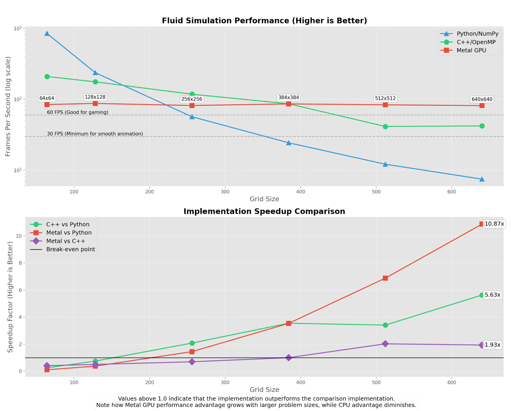

---

title: CS184 Team17 Final Report
subtitle:
date: 2025-04-08T00:05:27-08:00
slug: 184proj
draft: false
description:
keywords:
license:
comment: false
weight: 0
tags:
  - CS184
categories:
  - CS184
hiddenFromHomePage: false
hiddenFromSearch: false
hiddenFromRelated: false
hiddenFromFeed: false
summary:
resources:
  - name: featured-image
    src: featured-image.jpg
  - name: featured-image-preview
    src: featured-image-preview.jpg
toc: true
math: true
lightgallery: false
password:
message:
---

# Team 17 Report: Sound Propagation in Fluid Simulation

> https://alexdwastaken.github.io/Blog/posts/184proj/
> **Group members: Xize Duan, Allen Liu, Fangzhou Zhao, Phoenix Ye**
>
> Please read the online version for the best experience.

## Members and Contribution

Where we started: an empty project folder.

Xize Duan: Main Algorithm / Python Prototyping

Fangzhou Zhao: Algorithm Optimization

Allen Liu: Algorithm Optimization

Phoenix Ye: Visualization

## Abstract

This project presents an integrated simulation system for modeling the propagation of sound waves through fluid environments. We developed a fluid simulation based on the Navier-Stokes equations alongside a wave equation solver, enabling us to study their mutual interactions. The sound source is modeled as a thin oscillating object that exerts force on the fluid, capturing how sound influences fluid motion. Conversely, fluid perturbations are incorporated into the wave simulation to reflect how fluid dynamics affect sound propagation. The entire algorithm is accelerated using Apple GPUs. The final system visualizes the velocity field, fluid pressure field, and sound pressure field, and is capable of reading WAV files and simulating how they would sound after traveling through a 2D fluid-filled box.

## Technical Approach

### Fluid and sound simulation (Xize Duan)

For fluid simulation, we follow the implementation of the legendary paper "Stable Fluids" by Jos Stam (1999) and the blog “[Gentle Introduction to Realtime Fluid Simulation for Programmers and Technical Artists](https://shahriyarshahrabi.medium.com/gentle-introduction-to-fluid-simulation-for-programmers-and-technical-artists-7c0045c40bac)” by Shahriar Shahrabi. The idea is to realize the navier-stokes equation:
$$
\frac{\partial \mathbf{u}}{\partial t} + (\mathbf{u} \cdot \nabla)\mathbf{u} = -\frac{1}{\rho} \nabla p + \nu \nabla^2 \mathbf{u} + \mathbf{f}
$$

$$
\nabla \cdot \mathbf{u} = 0
$$

in a uniform fluid grid. They are solved on a uniform grid by breaking the update process into three main steps for the velocity field:

1. **Diffuse** – Simulate viscosity by spreading velocity across neighboring cells.
2. **Project** – Enforce incompressibility by making the velocity field divergence-free.
3. **Advect** – Move velocity along the current flow to simulate transport.

For the density (or scalar) field, we apply only diffuse and advect steps, as it does not require projection. We used the backward euler method for fluid simulation to enforce stability. Some steps require solving a sparse linear system (for example, when solving the possession equation for pressure), and we used a numerical method called Jacobi iteration to solve these.

For sound simulation, we implemented the wave equation in a uniform grid. This is easier than what we have thought.
$$
\frac{\partial^2 u}{\partial t^2} = c^2 \nabla^2 u
$$

### How fluid and sound influence each other (Xize Duan)

First, we need to think about how sound affects the fluid. We adopted the suggestions taken in the proposal feedback to simulate an oscillating object in the middle of the fluid. We selected a thin area of the fluid and exerted force based on F=ma, where a is calculated by sound sample rate and amplitude. We visualized the pressure change and “sonified” pressures at different points and made sure the simulation worked correctly.

Then we need to think about how the fluid affects the sound. Through some research and help of LLMs, we found the key is to calculate what's called the “pressure perturbation” which generates sound internally in a moving liquid. There are different ways like spatial filtering, temporal-spatial filtering, Helmholtz decomposition and so on, but we went with spatial filtering due to its simplicity (following Turbulence: the filtering approach by Germano, M.). The idea is to filter the fluid pressure field with a gaussian kernel, then subtract from the unfiltered kernel as the perturbation. We then incorporate the perturbation-generated sound back into the wave-equation based sound simulation.

### Visualization (Phoenix Ye)

We laid out four Matplotlib axes in a 2x2 grid and used *imshow* to render the density, fluid pressure, and sound pressure field with fixed color maps and value ranges so that color scales remain consistent over time. The velocity field is drawn once with a quiver at a constant scale to avoid per-frame autoscaling. We created two smoothing buffers and in each update() call we advance the simulation, apply exponential smooth to the raw u,v arrays, and then call quiver.set_UVC() together with im.set_array(), pressure_im.set_array(), sound_im.set_array(), and fps_text.set_text() to refresh the visuals and a performance overlap (stay time, FPS, max velocity, gravity).

Mouse-click and drag events are bound to callbacks that compute a Gaussian-falloff impulse centered on the click location and add it into the velocity fields, allowing interactive disturbance. Finally, FuncAnimation drives the whole animation by only redrawing the changed artists each frame. 

### Optimization (Allen Liu, Fangzhou Zhao)

The problems we encountered in this project were more a matter of code performance than algorithmic difficulties. Our earliest versions of the code were built primarily in python, and each step of the simulation process exists in its own NumPy routine-advect.py, diffuse.py, and project.py, respectively. In addition, the Poisson solve for pressure was wrapped in a Numba decorator that asked the JIT to run the inner loops in compiled form. Because the grids were genuine numpy.ndarray objects, the interpreter still had to manage Python objects, acquire and release the Global Interpreter Lock, and jump in and out of C every time one stage handed its result to the next. These problems largely affected the performance of our code, especially in large grid sizes. In order to claw back our code performance, we tried 2 of the following optimization methods and came up with some performance improvements visualizations. 

**Porting the exact same logic to C++:** 

- Optimization Implementation: Instead of two-dimensional NumPy arrays, we used a single std::vector<float> for each field and computed the one-dimensional offset with a tiny inline helper. All of the heavy double loops were preceded by an OpenMP pragma that collapses the two indices and lets the runtime parcel iterations out to the ten CPU cores of our M1 Pro. The algorithm, boundary handling and solver iteration count never changed; what did change was the cost per iteration. 
- Performance Improvements: On the same 640 × 640 case the C++ build now delivers about 41 FPS, a 5.6-fold speed-up over Python, and it holds roughly 50 FPS at 512 × 512 where the pure-Python code is already well below the 20-frame mark.

**Transfering the kernels to the GPU through Apple’s Metal API:** 

- Optimization Implementation: Each phase becomes its own compute shader: a thread receives its grid coordinates from the GPU dispatch header, checks whether the cell is on the boundary, and then performs the same arithmetic the CPU loop used to do. The host code written in Objective-C++ allocates the velocity, pressure and density buffers once in shared memory, launches the appropriate shader, and repeats the launch twenty times when an iterative solution is required. With thousands of GPU lanes working in parallel, the frame time is dominated by a fixed kernel-launch overhead rather than by the size of the grid. 
- Performance Improvements: As the red squares in the following figure 1 indicate, the Metal version stays near 80–90 FPS from 128 × 128 all the way to 640 × 640, which translates to a 10.9 × acceleration over Python and nearly 2 × over the multi-threaded C++ code on the largest test. Only on the tiniest mesh does the GPU fall slightly behind the CPU because the launch cost outweighs the scant arithmetic on so few cells.

**Lessons Learned during the optimization process:** 

For us, none of the members of our group were very familiar with optimization algorithms. In the process of completing the optimization part of this project, most of the content is the result of our continuous exploration. How to use OpenMP, how to port python programs to C++, and shader-related optimization logic were definitely some of the additional things we learned besides the fluid simulation algorithm. But more importantly, it also made us realize that in the process of completing an open project, there is a high probability that we will encounter problems that we never learned before and don't know how to deal with, and how to deal with these contents outside of the course is the more meaningful thing that we have learned.

## Results

### Videos

| Fluid simulation only - Different density diffuse together   |
| ------------------------------------------------------------ |
| <iframe src="https://drive.google.com/file/d/1zEQvjM4EHcQ6nR_4Rmw-FLZvQQcEyhi6/preview" width="640" height="360"></iframe> |

| Full simulation only - With a oscillating sound sorce in the middle and mouse interaction |
| ------------------------------------------------------------ |
| <iframe src="https://drive.google.com/file/d/1c0CcOC0aApM5i4DSn9zuKmGoPZ3cF8N4/preview" width="640" height="360"></iframe> |

| Sound simulation only - To demonestrate our wave equation works properly |
| ------------------------------------------------------------ |
| <iframe src="https://drive.google.com/file/d/1TvQDxz7H5RuSBOihGQtz9GrvqcWFrygR/preview" width="640" height="360"></iframe> |

|   Full Simulation - Sound and fluid, everything together!   |
| ---- |
|   <iframe src="https://drive.google.com/file/d/1ZxmWbSlN7DG4j1yE-zgPk_sW5x0I5SxQ/preview" width="640" height="360"></iframe>   |

### Audio

We are working with sound simulation - why not try to "sonify" the liquid pressure field and sound pressure field?

(It turns out the simulation only preserve little low frequency detail and distorted all high frequency detail - we will explain why)

**Audio 1: "One Two Three Four Five"**

| Original Audio                                               | Liquid Pressure Field (Corresponds to the lower left graph in the full simulation above) | Sound Pressure Field (Corresponds to the lower right graph in the full simulation above) |
| ------------------------------------------------------------ | ------------------------------------------------------------ | ------------------------------------------------------------ |
| <audio controls>   <source src="audios/12345/egaudio.wav" type="audio/wav">   Your browser does not support the audio element. </audio> | <audio controls>   <source src="audios/12345/output.wav" type="audio/wav">   Your browser does not support the audio element. </audio> | <audio controls>   <source src="audios/12345/foutput.wav" type="audio/wav">   Your browser does not support the audio element. </audio> |

**Audio 2: "This is team 17 from CS 184"**

| Original Audio                                               | Liquid Pressure Field (Corresponds to the lower left graph in the full simulation above) | Sound Pressure Field (Corresponds to the lower right graph in the full simulation above) |
| ------------------------------------------------------------ | ------------------------------------------------------------ | ------------------------------------------------------------ |
| <audio controls>   <source src="audios/t17/t172.wav" type="audio/wav">   Your browser does not support the audio element. </audio> | <audio controls>   <source src="audios/t17/output.wav" type="audio/wav">   Your browser does not support the audio element. </audio> | <audio controls>   <source src="audios/t17/foutput.wav" type="audio/wav">   Your browser does not support the audio element. </audio> |

**Audio 3: "Never gonna give you up (copyright strike-proof version)"**

So distorted that you can only here the drums with reverb!

### Optimization Performance

We have to point out this optimization is **only done on the calculations, not the visualizations**! We can run the pure simulation without visualization very efficiently, but we did not optimize the performance of matplotlib (which is not the goal in our original proposal - we focus on simultation, not rendering). The numbers in the graph below are measured with matplotlib off.

